# Face Verification & Identification — V1
> **CIE 555 — Neural Networks and Deep Learning**  
> University of Science and Technology, Zewail City · Spring 2026  
> **Status: 🚧 Work in Progress — V2 coming with MTCNN face cropping, ResNet50V2, InceptionResNetV2, and hard triplet mining**

---

## Overview

A deep learning pipeline for **face verification** on the LFW (Labeled Faces in the Wild) dataset — determining whether two face images belong to the same person using Siamese Networks.

This version implements and compares two backbone architectures across two loss functions, forming a 2×2 experimental grid.

---

## Dataset

| Property | Details |
|----------|---------|
| Source | [LFW — Labeled Faces in the Wild](https://www.kaggle.com/datasets/jessicali9530/lfw-dataset) |
| Filter criteria | ≥ 12 images per identity |
| Split | Identity-level 80/20 — validation contains fully unseen people |

### Identity Distribution (after filtering)

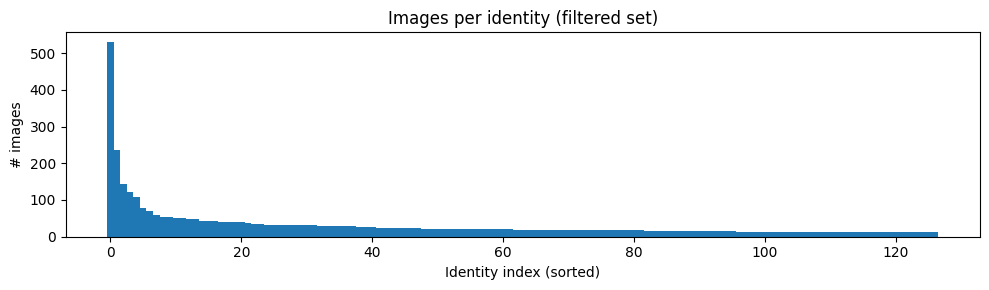

> **Known limitation:** The dataset is heavily imbalanced at the identity level — a few celebrities (e.g. George W. Bush: 530 images) dominate the distribution. V2 will apply a per-identity image cap to fix this.

### Sample Identities

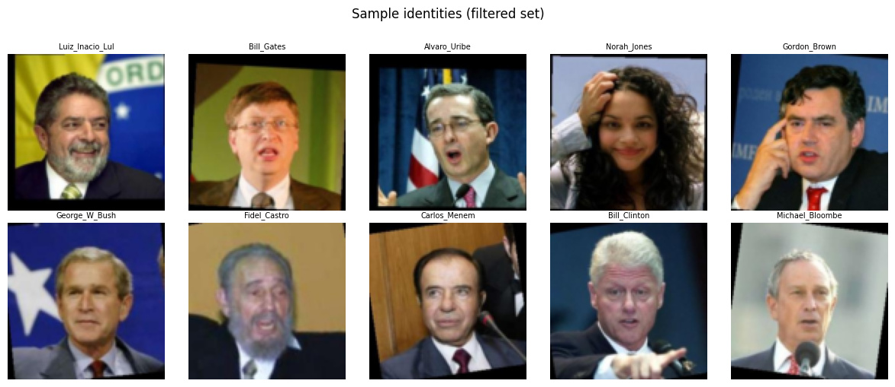

---

## Experiments

### 2×2 Experimental Grid

| | **Contrastive Loss** | **Triplet Loss** |
|---|---|---|
| **Custom CNN** | ✅ | ✅ |
| **EfficientNetB0** | ✅ | ✅ |

### Architecture 1 — Custom CNN Backbone
- 4 convolutional blocks: 32 → 64 → 128 → 256 filters
- BatchNormalization after every conv layer
- Progressive Dropout: 0.15 → 0.20 → 0.25 → 0.30
- GlobalAveragePooling → Dense(256) → L2-normalized embedding

### Architecture 2 — EfficientNetB0 (Transfer Learning)
- Pretrained on ImageNet, top layers replaced
- Fine-tuned from layer 150 onward
- Why EfficientNetB0: best accuracy/parameter tradeoff via compound scaling

### Loss Functions (both implemented manually)
- **Contrastive Loss** (margin = 1.0): pair-based, pulls same-person embeddings together
- **Triplet Loss** (margin = 0.4): triplet-based, enforces d(a,p) < d(a,n) + margin

---

## Results

### ROC Curves & AUC

| Model | AUC-ROC |
|-------|---------|
| Custom CNN + Contrastive | **0.7719** |
| EfficientNetB0 + Contrastive | 0.7369 |
| EfficientNetB0 + Triplet | 0.7547 |
| Custom CNN + Triplet | 0.7147 |

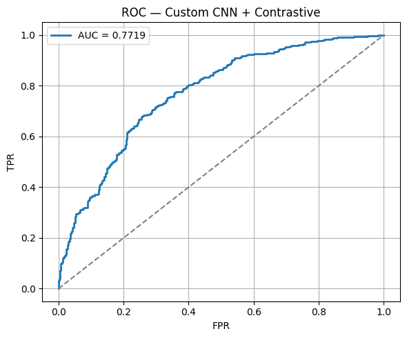

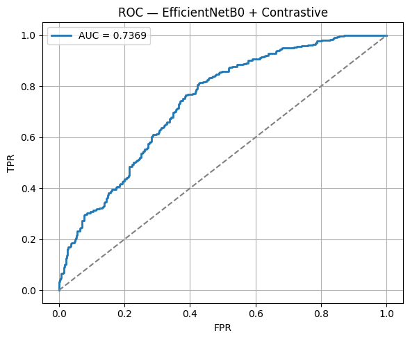

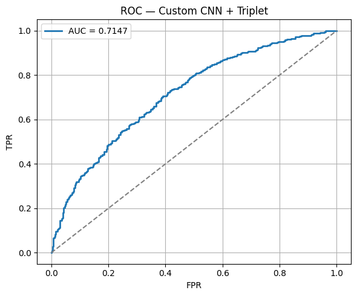

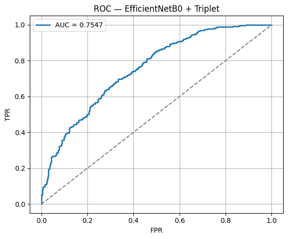

### Distance Distributions

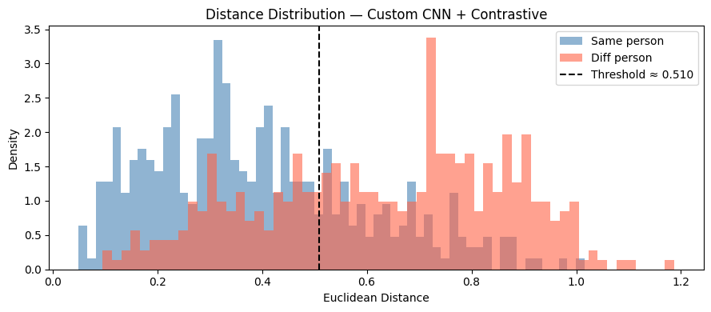

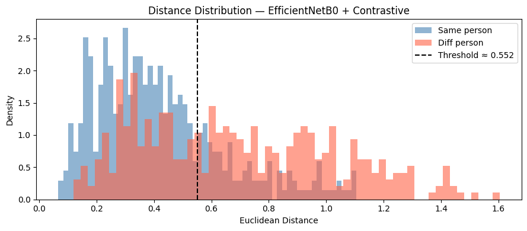

### Threshold Calibration

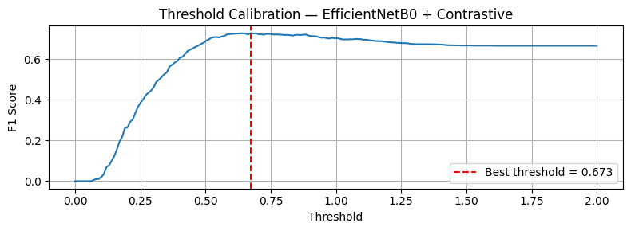

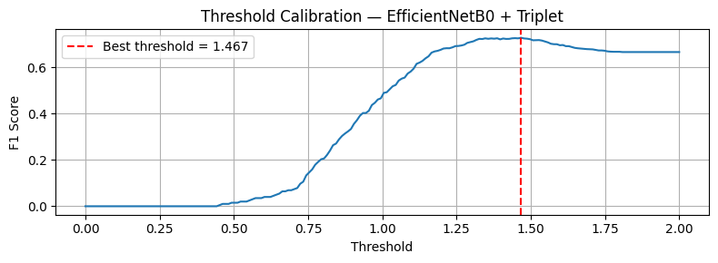

### Inference Examples

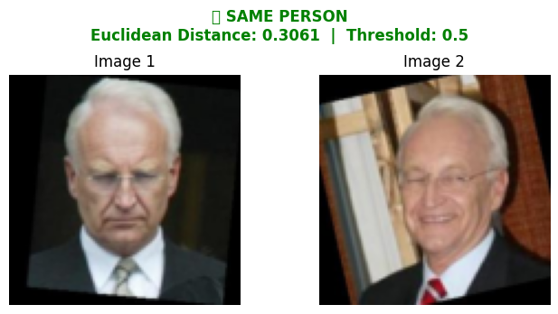

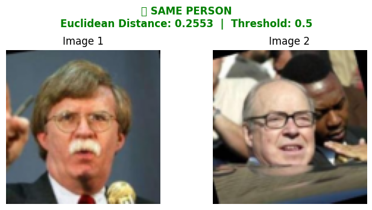

---

## Planned Improvements (V2)

- [ ] **MTCNN face detection**: crop facial region automatically, remove background/clothing noise
- [ ] **Identity-level image cap**: fix class imbalance by capping dominant identities
- [ ] **ResNet50V2**: replace EfficientNetB0 for DeepFace-style pair verification
- [ ] **InceptionResNetV2**: FaceNet-style backbone with semi-hard triplet mining
- [ ] **Hard triplet mining**: select hard positives and semi-hard negatives instead of random triplets
- [ ] **Binary Cross-Entropy** as an additional loss paradigm

---

## Tech Stack

- **Python 3**
- **TensorFlow / Keras**
- **NumPy, scikit-learn**
- **Matplotlib**
- **KaggleHub**

---

## File Structure

```
├── Face_verification_V1.ipynb   # Full pipeline
├── images/                      # All result plots
└── README.md
```

---

## Author

**Ahmed Gamal** — [@AhmedGamal04](https://github.com/AhmedGamal04)
